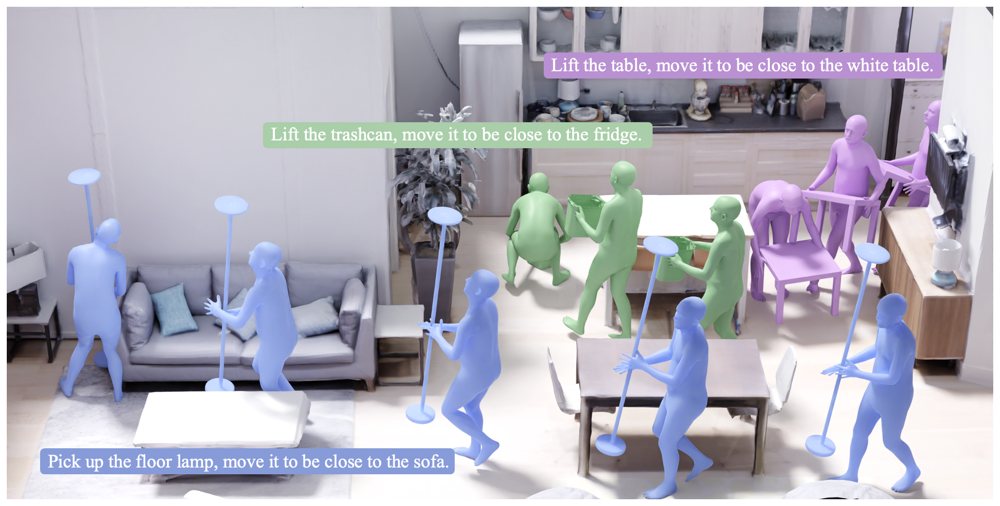

# Controllable Human-Object Interaction Synthesis (ECCV 2024 Oral)
This is the official implementation for the ECCV 2024 [paper](https://arxiv.org/pdf/2312.03913). For more information, please check the [project webpage](https://lijiaman.github.io/projects/chois/).



## Environment Setup
> Note: This code was developed on Ubuntu 20.04 with Python 3.8, CUDA 11.3 and PyTorch 1.11.0.

Clone the repo.
```
git clone https://github.com/lijiaman/chois_release.git
cd chois_release/
```
Create a virtual environment using Conda and activate the environment. 
```
conda create -n chois_env python=3.8
conda activate chois_env 
```
Install PyTorch. 
```
conda install pytorch==1.11.0 torchvision==0.12.0 torchaudio==0.11.0 cudatoolkit=11.3 -c pytorch
```
Install PyTorch3D. 
```
conda install -c fvcore -c iopath -c conda-forge fvcore iopath
conda install -c bottler nvidiacub
pip install --no-index --no-cache-dir pytorch3d -f https://dl.fbaipublicfiles.com/pytorch3d/packaging/wheels/py38_cu113_pyt1110/download.html
```
Install human_body_prior. 
```
git clone https://github.com/nghorbani/human_body_prior.git
pip install tqdm dotmap PyYAML omegaconf loguru
cd human_body_prior/
python setup.py develop
```
Install BPS.
```
pip install git+https://github.com/otaheri/chamfer_distance
pip install git+https://github.com/otaheri/bps_torch
```
Install other dependencies. 
```
pip install -r requirements.txt 
```

### Prerequisites 
Please download [SMPL-X](https://smpl-x.is.tue.mpg.de/index.html) and put the model to ```data/smpl_all_models/```.

If you would like to generate visualizations, please download [Blender](https://www.blender.org/download/) first. And modify ```BLENDER_PATH, BLENDER_UTILS_ROOT_FOLDER, BLENDER_SCENE_FOLDER``` in line 8-10 of ```chois_release/manip/vis/blender_vis_mesh_motion.py```. 

Please download all the [data](https://drive.google.com/file/d/1ZG-9--RfUWj5oWYnvcONNuRuxaH_Zpw1/view?usp=sharing) and put ```processed_data``` to your desired location ```your_path/processed_data```.  

### Testing: Generating single-window interaction sequences for OMOMO objects.  
Please download pretrained [model](https://drive.google.com/drive/folders/1gqw3EHiEMqw1OXqH92Axoc5FJntA_E5x?usp=sharing) and put ```pretrained_models/``` to the root folder. If you'd like to test on 3D-FUTURE objects, please add ```--unseen_objects```. For quantitative evaluation please add ```--for_quant_eval```.
```
sh scripts/test_chois_single_window.sh 
```

### Testing: Generating scene-aware long sequence for OMOMO objects.  
Note that this following command will generate long sequence visualizations in an empty floor. If you'd like to visualize in a 3D scene, please check next instruction below. 
```
sh scripts/test_chois_long_seq_in_scene.sh 
```

### Run visualization for interaction sequence and 3D scenes 
Please run the command to generate long sequence first. This will save human and object meshes to .ply file. If you want to skip the visualization for long sequence in an empty floor, you can change line 2449 in ```trainer_chois.py```, set ```save_obj_only``` to True. 
```
sh scripts/test_chois_long_seq_in_scene.sh 
```
Then edit line 109 and line 110 at ```utils/vis_utils/render_res_w_blender.py``` to call blender and visualize the generated sequence in the given 3D scene.  
```
cd utils/vis_utils
python render_res_w_blender.py 
```

### Training 
Train CHOIS (generating object motion and human motion given text, object geometry, and initial states). Please replace ```--entity``` with your account name. 
```
sh scripts/train_chois.sh
```

### Computing Evaluation Metrics (FID, R-precision)
We followed prior work on human motion generation (Generating Diverse and Natural 3D Human Motions from Text. CVPR 2022.) for evaluating human motion quality and text-motion consistency. Since the motion distribution in our paper is different from HumanML3D, we trained corresponding feature extractors on OMOMO dataset (Object Motion Guided Human Motion Synthesis. SIGGRAPH Asia 2023.). We provided trained feature extractors [here](https://drive.google.com/drive/folders/1hGDYEy91Tk7FC1U_8BouhlSp5RQkEJuY?usp=sharing). To run this evaluation, please check the code and modify corresponding paths for feature extractors and the results that you need to evaluate. 
```
cd t2m_eval/
python final_evaluations.py 
```

### Generating new data for scene-aware interaction synthesis.  
We used the following code for generating waypoints in 3D scenes. If you'd like to generate more data, please check ```create_eval_data.py```. 
```
cd utils/create_eval_data/
python create_eval_data.py 
```

### Citation
```
@inproceedings{li2023controllable,
  title={Controllable human-object interaction synthesis},
  author={Li, Jiaman and Clegg, Alexander and Mottaghi, Roozbeh and Wu, Jiajun and Puig, Xavier and Liu, C. Karen},
  booktitle={ECCV},
  year={2024}
}
```

### Related Repos
We adapted some code from other repos in data processing, learning, evaluation, etc. Please check these useful repos. 
```
https://github.com/lijiaman/omomo_release
https://github.com/lijiaman/egoego_release
https://github.com/EricGuo5513/text-to-motion 
https://github.com/lucidrains/denoising-diffusion-pytorch
https://github.com/jihoonerd/Conditional-Motion-In-Betweening 
https://github.com/lijiaman/motion_transformer 
``` 